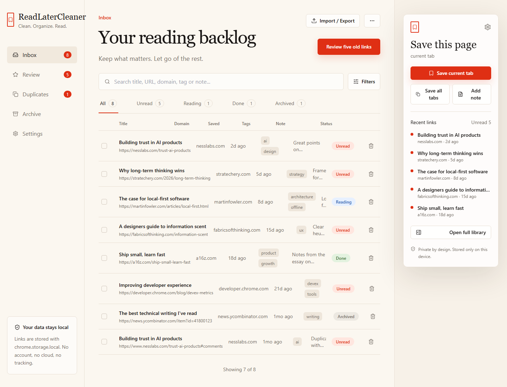
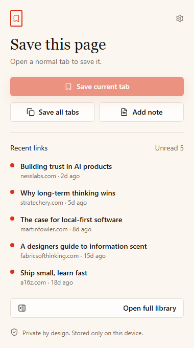

# ReadLaterCleaner

**A privacy-friendly browser extension for cleaning your read-later backlog.**

ReadLaterCleaner helps students, researchers, developers, writers, and heavy tab
savers review what they saved, remove what no longer matters, and export useful
links. It is local-first, account-free, and built on Manifest V3.



> **Project status:** usable MVP, actively developed. The current release is
> ready to load as an unpacked Chrome-compatible extension.

## Features

- Save the current tab from the popup
- Save all tabs in the current window
- Store title, URL, domain, saved date, tags, note, and status
- Full options dashboard with search and status filters
- Status workflow: unread, reading, done, archived
- Duplicate URL detection and merge/delete actions
- Review mode for five old unread links
- Markdown export for reading lists
- JSON backup export and import
- Local browser storage with no analytics and no remote backend

## Screenshots

### Options dashboard


### Extension popup



## Install locally

1. Run the production build:

   ```bash
   npm install
   npm run build
   ```

2. Open Chrome or another Chromium-based browser.
3. Go to `chrome://extensions`.
4. Enable **Developer mode**.
5. Click **Load unpacked**.
6. Select the `dist` folder.

The extension popup is available from the toolbar icon. The full library opens
through the extension options page.

## Development

```bash
npm install
npm run dev
npm run lint
npm test
npm run build
```

During development, `options.html` and `popup.html` can be opened through the
Vite dev server. Browser-extension APIs are used when available; otherwise the
app falls back to local demo behavior for UI development.

## Permissions

ReadLaterCleaner requests only:

- `storage` — saves your library locally with `chrome.storage.local`
- `tabs` — reads the title and URL of the current tab or current window tabs
  only when you click save actions

The extension does not request host permissions and does not transmit browsing
data to a remote service.

## Architecture

- Manifest V3 browser extension
- Vite + React + TypeScript
- Tailwind CSS
- `chrome.storage.local` storage adapter with local development fallback
- Separated domain logic, storage layer, extension API helpers, popup UI, and
  options dashboard
- Vitest coverage for normalization, duplicate detection, review queue, filters,
  Markdown export, and backup import/export

## Roadmap

See [ROADMAP.md](ROADMAP.md).

## Contributing

Focused issues and pull requests are welcome. Please read
[CONTRIBUTING.md](CONTRIBUTING.md) before proposing larger changes.

## Security

Report privacy or security issues according to [SECURITY.md](SECURITY.md).

## License

[MIT](LICENSE) © 2026 Denis Dyakov

